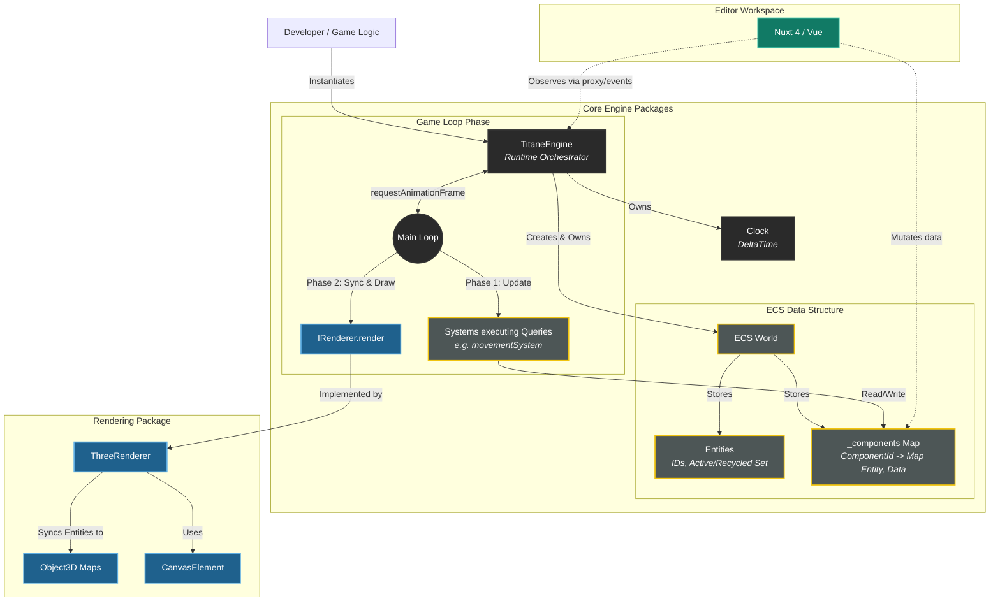

# Titane Engine - Architecture Specification 🪐

## 1. Vision & Philosophy
Titane is a high-performance, **Data-Oriented** 3D game engine for the web. 
It follows a strict **Entity-Component-System (ECS)** pattern to ensure maximum decoupling between data, logic, and rendering.

### Core Principles
- **Data over Objects:** Components are pure data structures (Interfaces/Types), not classes with logic.
- **Composition over Inheritance:** Game logic is built by combining components, not by extending base classes.
- **Logic over Data:** Systems handle all logic and transformations by iterating over filtered sets of entities.
- **Renderer Agnostic:** The core engine knows nothing about Three.js. The renderer is a system that observes the ECS state.

---

## 2. Monorepo Structure
- `packages/core`: The ECS Runtime. Contains the World, Component storage, Query engine, and System Scheduler.
- `packages/renderer`: The Three.js bridge. Contains the `RenderSystem` and 3D object pooling.
- `apps/editor`: Nuxt 4 application. Visualizes the ECS World and allows real-time data editing.

### Dependency Graph & Core Engine Flow

---

## 3. ECS Specification

### Entity
An **Entity** is a unique `number` (ID). It is a mere container/label for components.

### Component
A **Component** is a pure data object. 
- Must be a plain TypeScript `interface` or `type`.
- Must NOT contain any methods or logic.
- Example: `Position { x: number, y: number, z: number }`.

### System
A **System** is a logic unit that runs every frame.
- Signature: `(world: World, deltaTime: number) => void`.
- Responsibilities: Queries the world for specific component combinations and updates their data.

### World
The **World** is the global coordinator.
- Stores all entities and their components.
- Manages the execution order of Systems.
- Provides the Public API for the user.

---

## 4. Execution Flow (The Loop)
Every frame, the `World` executes systems in a strictly controlled order:

1. **Input Systems:** Handle keyboard/mouse/gamepad events.
2. **Physics Systems:** Update positions based on forces/collisions.
3. **Logic Systems:** User-defined gameplay logic (AI, triggers, etc.).
4. **Transform Systems:** Update global matrices based on parent-child hierarchy.
5. **Render Systems:** Synchronize Three.js objects with ECS data and call `renderer.render()`.

---

## 5. Public API Guidelines
To keep the Core stable, developers must only use the following primitives:

| Action | API Method |
| --- | --- |
| Create an object | `world.createEntity()` |
| Add data | `world.addComponent(entity, ComponentType, data)` |
| Get data | `world.getComponent(entity, ComponentType)` |
| Filter objects | `world.query([ComponentA, ComponentB])` |
| Add logic | `world.addSystem(mySystemFunction)` |

---

## 6. Renderer Integration Strategy
The `Renderer` package acts as a "Side Effect" of the ECS:
1. It maintains a **Map<Entity, Object3D>**.
2. A `SyncSystem` detects when a `MeshComponent` is added to an Entity.
3. It creates the corresponding Three.js object and adds it to the internal Map.
4. Every frame, it copies `Position/Rotation` data from ECS to the Three.js objects.

---

## 7. Editor Communication
The Nuxt Editor interacts with the engine via a **Proxy/Event Bridge**:
- **Editor -> Engine:** The UI modifies a component value via `world.updateComponent()`.
- **Engine -> Editor:** The engine emits events (e.g., `EntityCreated`) so the Nuxt Hierarchy can refresh.