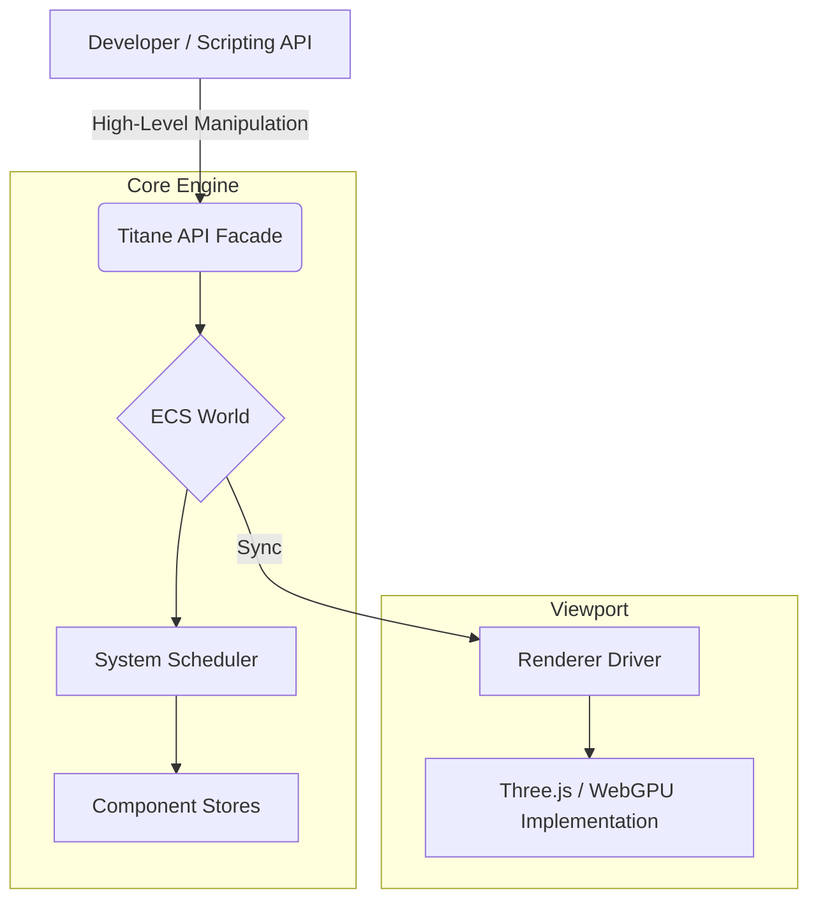

# Titane Engine

**Titane** is a data-oriented 3D engine (ECS) designed for high-performance web. It strictly separates business logic, visual rendering, and world state to provide production stability and scalability.

---

## Philosophy & Vision

3D development on the web often suffers from coupling that is too tight between visual objects and game logic. **Titane** solves this problem by applying three fundamental principles:

1.  **Single Source of Truth (ECS)**: All world state resides in a system of pure Entities and Components. No hidden data in rendering objects.
2.  **Rendering Agnosticism**: The engine's core is a "logical fortress". It does not know Three.js or WebGPU; it communicates with them via interchangeable **Drivers**.
3.  **Abstraction**: While the ECS is the engine under the hood, the user manipulates a high-level API (Facade) that simplifies complex operations without sacrificing performance.

---

## 🗺️ Roadmap

| Phase | Focus | Key Objective |
| :--- | :--- | :--- |
| **Phase 1: Foundations** | **ECS Core** | Ultra-stable core, Three.js Driver, secure "Fortress" API. |
| **Phase 2: Elite Editor** | **Visual Tooling** | Hierarchy, Dynamic Inspector, real-time Live Sync. |
| **Phase 3: Simulation** | **Physics & Logic** | Rapier (WASM) Integration, Phase Scheduler (Input/Update/Render). |
| **Phase 4: Abstraction** | **High-Level API** | Simplified scripting systems, Prefabs, JSON Scene Management. |

---

## Architecture & Structure

Titane is built on a layered architecture. The end developer only interacts with the top layer, while the engine optimizes data deep down.

For an in-depth look at the internal data flow, ECS definitions and the Engine loop, check out the [Architecture Specification](ARCHITECTURE.md).



## Useful Commands

```bash
# Run the editor with HMR
npm run editor:dev

# Compile the core engine in watch mode
npm run core:dev
```

## End api example

```typescript
// What user writes
const player = engine.createGameObject('Player');
player.setPosition(0, 5, 0);

// What Titane executes in the background (Performance, ECS)
updateComponent(world, 42, TRANSFORM_ID, (d) => d.position.y = 5);
```

## Framework Agnostic
Although Titane's official editor is powered by Nuxt 4, the engine itself is a 100% independent TypeScript library.

As a developer, you can integrate the Titane runtime into any environment:

Vanilla JS/TS for maximum performance.

Vue / Nuxt for reactive interfaces.

React / Next.js or Svelte via dedicated hooks.

Titane does not impose a UI framework upon you; it simply powers your 3D world.

## Tech Stack

- **Core Engine**: TypeScript (Data-Oriented Design)
- **Architecture**: ECS (Entity Component System)
- **Renderer**: Driver-based (Default: Three.js)
- **Editor**: Nuxt 4
- **Physics**: Rapier (WASM)